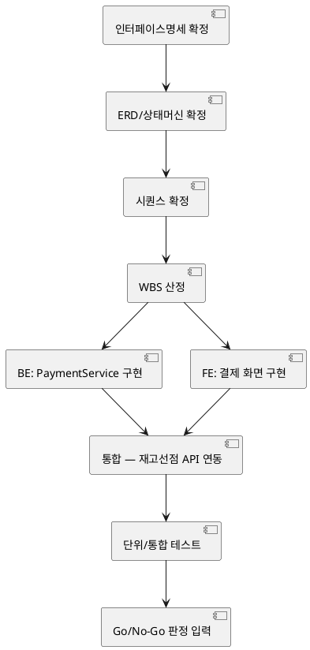

# 샘플: 의존성 맵 (Tasks, Domain+Bolt)

```plantuml
@startuml
[인터페이스명세 확정] --> [ERD/상태머신 확정]
[ERD/상태머신 확정] --> [시퀀스 확정]
[시퀀스 확정] --> [WBS 산정]
[WBS 산정] --> [BE: PaymentService 구현]
[WBS 산정] --> [FE: 결제 화면 구현]
[BE: PaymentService 구현] --> [통합 — 재고선점 API 연동]
[FE: 결제 화면 구현] --> [통합 — 재고선점 API 연동]
[통합 — 재고선점 API 연동] --> [단위/통합 테스트]
[단위/통합 테스트] --> [Go/No-Go 판정 입력]
@enduml
```
크리티컬 패스: 인터페이스명세→ERD/상태머신→시퀀스→WBS→BE구현→통합→테스트 (BE 구현이 재고 API 의존성 때문에 병목)

---
근거: 이 샘플에서 신규 작성.
