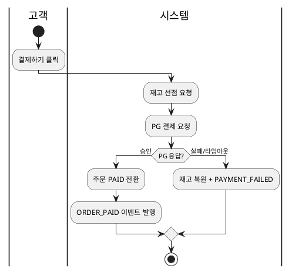

# 샘플: 비즈니스 프로세스 (Design, Domain: Order, 스윔레인)

```plantuml
@startuml
|고객|
start
:결제하기 클릭;
|시스템|
:재고 선점 요청;
:PG 결제 요청;
if (PG 응답?) then (승인)
  :주문 PAID 전환;
  :ORDER_PAID 이벤트 발행;
else (실패/타임아웃)
  :재고 복원 + PAYMENT_FAILED;
endif
stop
@enduml
```
예외 흐름 E1: 재고 선점 실패(품절) → 결제 요청 자체를 생성하지 않고 즉시 "품절" 응답

---
근거: 이 샘플에서 신규 작성.
